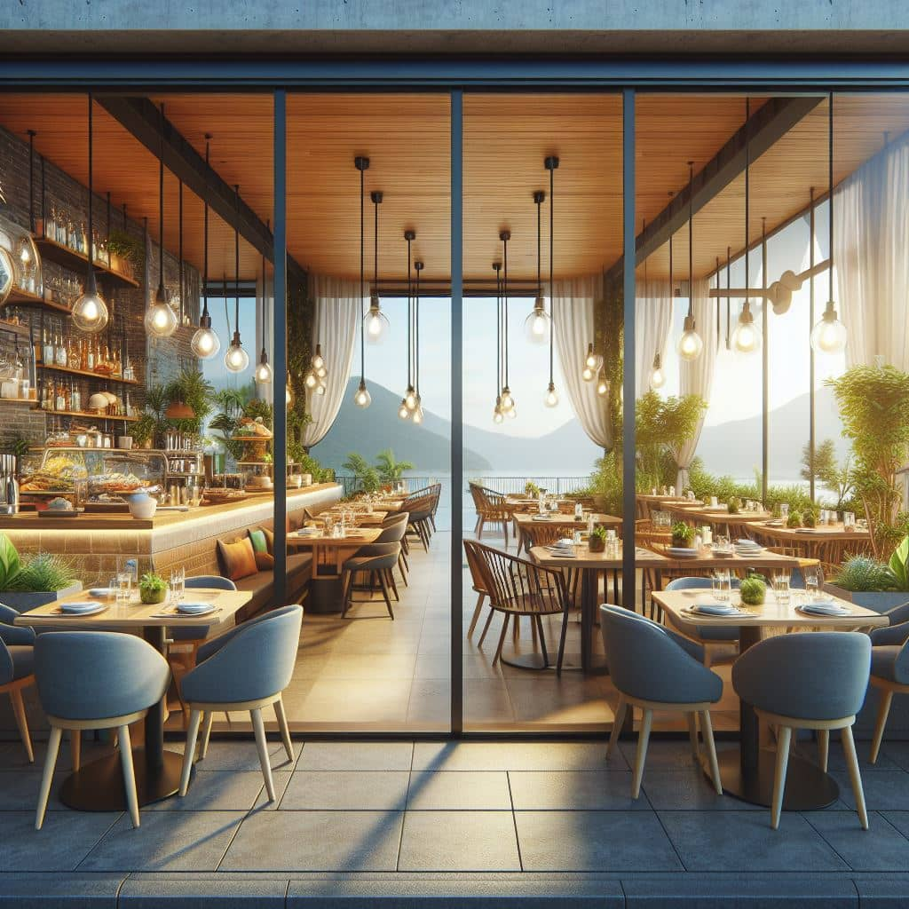
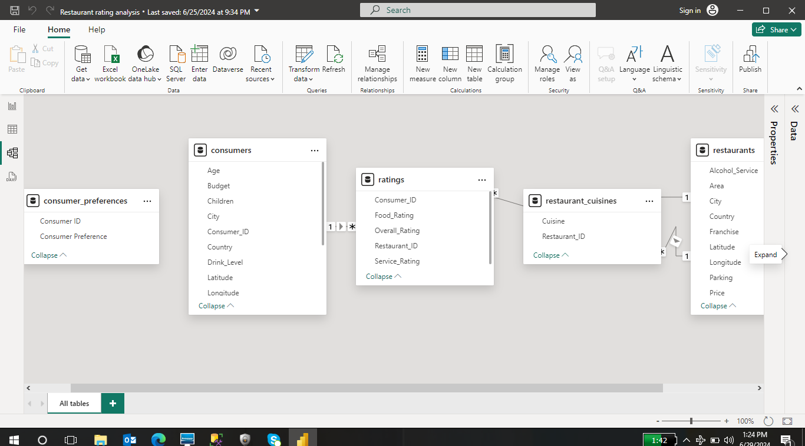
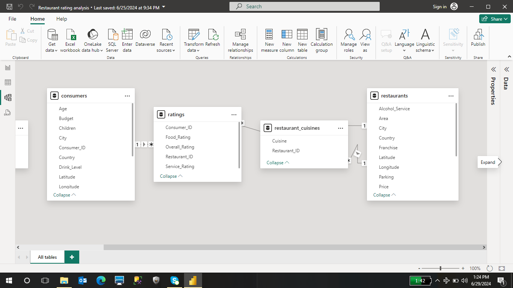
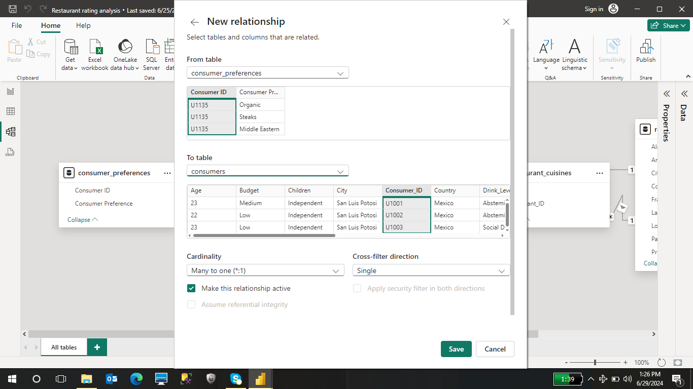
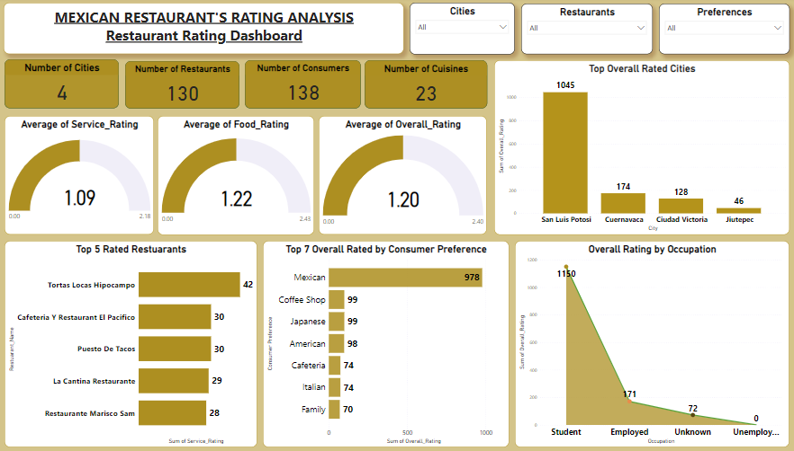
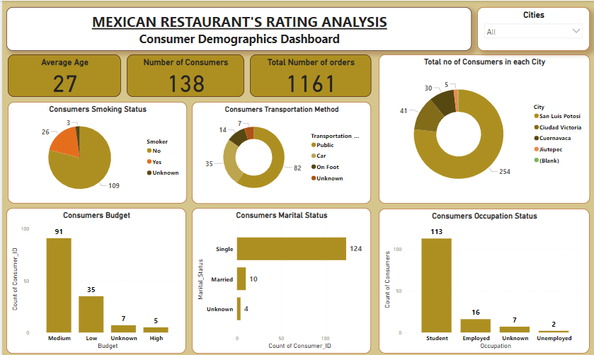
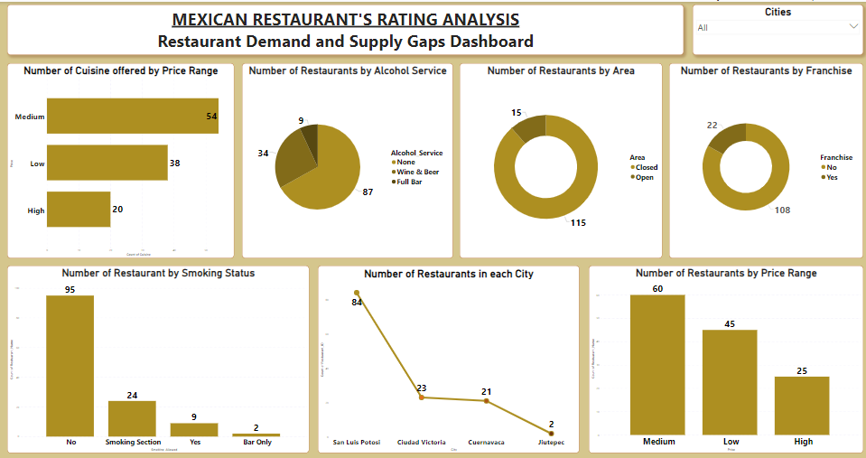

# Capstone Project: Mexican-Restaurant-Rating-Analysis

---

# Introduction

---
This Analysis is done by me using Power BI to give insight into the Restaurant ratings in Mexico, using the restaurant rating dataset which contains information about Restaurants in Mexico. A customer survey was carried out in 2012 to collate information about each restaurant, their ratings, their cuisines, information about their consumers and the preferences of these consumers. 
Using the Data given, I created three (3) Dashboards to visualize the Restaurant's ratings/performances, Consumer Demography and Demand and supply gaps. I analysed the dataset and provided answers to these questions listed below.

# Problem Statement
1. What can you learn from the highest rated restaurants? Do preferences have an effect on ratings?
2. What are the Consumer Demographics? Does this indicate a bias in the data sample?
3. Are there any demand and supply gaps that you can exploit in the market?
4. If you were to invest in a restaurant, which characteristics would you be looking for?

# Skills demonstrated
- Data transformation
- Data cleaning
- Visualization
- Modelling
- Filters
- Problem solving

# Data Sourcing
This analysis was done using **Power BI** and the Datasets used were precisely provided for this Capstone Project by the Training Institute i am in training with, **Digitaley Drive**. The Tables used for this Analysis were 5 in number, they are; 
- Consumer Preference,
- Consumers,
- Ratings,
- Restaurants Cuisines,
- Restaurants. 

# Data Importation and Transformation
Firstly, I downloaded the CSV files and imported them separately into Power Query Editor. I imported the Customer Preferences table first into Power Query Editor, and it looked clean but I decided to rename some columns. 
Then I imported the second table, Consumers, I noticed lots of empty cells (null values), data types on all columns were accurate. I replaced the null values in the Budget, Occupation, Children, Marital Status, Transportation Method and Smoker Columns with unknown using the find and replace function in Power Query Editor. 
The next dataset I imported was the Ratings dataset. Everything looked precise, datatypes were accurate and there wasn’t any null values. 
The Restaurant Cuisines dataset had only two columns, no errors, no null values and all datatypes were accurate.
The last dataset I imported was the Restaurants dataset. It had 56 null values in the zip code column which I replaced with 0. I changed the datatype of the zip code column from Decimal Number to ‘whole number 123’. I also renamed a column to Restaurant Name. However, I eventually had no use for the zip code column in this analysis, despite the corrections made, it just turned out to be good practice.

# Modelling
I later noticed while working on the project that the Consumer Preference table was a little bit isolated and wasn’t connected to the other tables, and I proceeded to manage the relationship between the Consumer Preference table and the Consumers table using the Consumer ID columns in each table as the connecting factor in other for all tales to interact accurately with each other. See images below;

Auto Model                   |       Adjusted Model
:---------------------------:|:-----------------------------------------:
     |     

# Creating New Relationship between Tables

---

# Findings

## Restaurant Rating Dashboard
In the Restaurant Rating Dashboard, I added 4 card visuals to show Number of Cities (4), Number of Restaurants (130), Number of Consumers (138) and Number of Cuisines (23).
The Average Service Rating is 1.09, Average Food Rating is 1.22, and Average Overall Rating is 1.20. The Top Rated Cities shows San Luis Potosi as the top rated city out of 4 cities with 1,045 ratings. Top 5 rated Restaurants shows Tortas Locas Hipocampo Restaurant as the top rated. Top 7 rated Consumer preference shows Mexican cuisine as highly rated. Overall Rating by Occupation shows Students rated more with a rating of 1,150, followed by employed consumers with a sum of 179. 
I added City, Restaurants and Preferences slicers to show varied data in each visual when applied. For instance using the preferences slicer helps to answer the first question "Do preferences have an effect on ratings?" shows that preferences indeed affects ratings because Mexican cuisine has the highest ratings, while cuisines like African has 0 ratings.

---

## Consumer Demographics Dashboard
The concluding analysis of the Consumer Demographics Dashboard shows a high rate of 124 single consumers, while married consumers are 10. Single consumers order more and rate more, their budget is medium and they reside more in the San Luis Potosi city. Public Transport is their frequent mode of Transportation and a large rate of Consumers don't smoke. So yes, there is a bias in the data set because the rate of married consumers are low.

---

## Demand and Supply Gaps Dashboard
Demand and Supply Gaps Dashboard shows that 22 Restaurants have or are open to a franchise while 108 Restaurants do not have or are not open a franchise. 
87 Restaurants don't offer alcohol service, 37 Restaurants offer Wine and Beer alone while, 9 Restaurants offer a full option Bar. 54 Restaurants offer medium price cuisines, 34 Restaurants offer low price cuisines, while 20 restaurants offer high price cuisines. From the information gathered, it can be seen that there is a gap in regards to the fact that the Franchise offering is low and there are more restaurants offering Mexican cuisine in San Luis Potosi. I would exploit franchising in other to reach more married consumers in other cities. Possibly offer home deliveries to cater to more married consumers who prefer staying in than eating out. 

---

# Recommendations and Conclusion
In conclusion, I would recommend that as an investor, one should look out for these Characteristics; 
- Restaurants owned by open-minded Management, that are open to try new things Business wise, enabling the Restaurant reach more customers. 
- Location as well is another important characteristic, it is important to invest in a Restaurant that is in a location close to a large number of their Clientele. 
- Restaurants in close proximity to their clients frequent transportation method.
- Investing in a highly rated Restaurant is another important factor and also,
- A Restaurant that has a flexible price range, so as to cater to a broader customer base.
- Lastly, investing in a restaurant that generates high revenue. 

---
